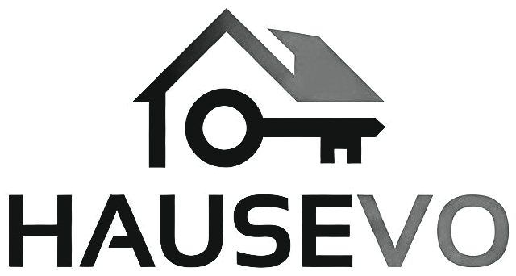
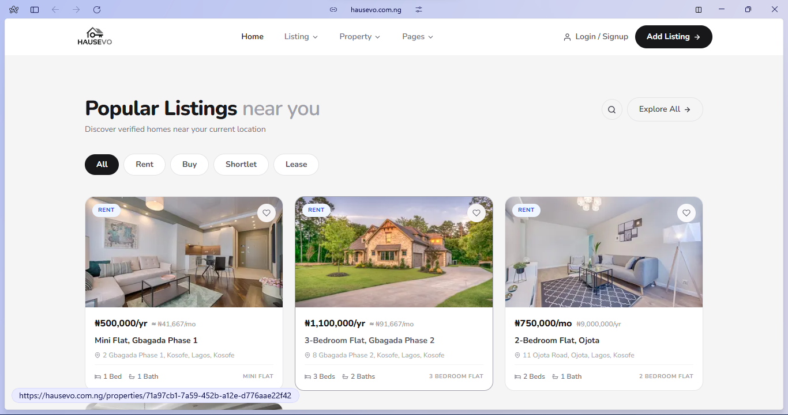
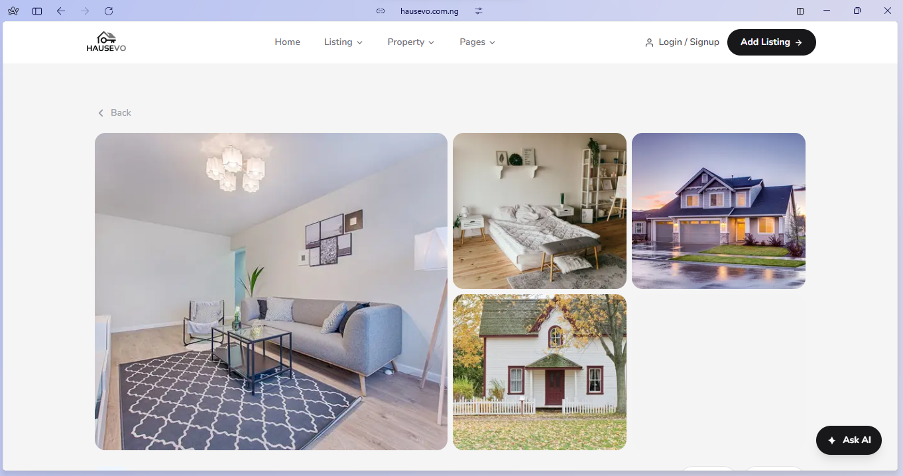

# Hausevo 

**Modern Real Estate Platform for Nigeria**

Hausevo is a full-featured property listing and management platform designed for the Nigerian real estate market. It empowers agents, developers, property owners, and operations teams to list properties faster, manage tenants efficiently, and streamline day-to-day operations.

## Key Features

### Admin & Operations Dashboard
- Rich property listings with photos, pricing, health scores & verifications
- Tenancy and tenant management
- Maintenance request handling
- Dispute resolution tools
- Artisans & service providers management
- Support ticket system
- Audit logs and verifications
- Real-time updates and clean responsive UI

### Tech Stack
- **Frontend**: Next.js + TypeScript + Tailwind CSS
- **Backend/Database**: Prisma + PostgreSQL + NodeJs + Google Apis (Google Gemini Engine)
- **Deployment**: PM2 + Nginx on VPS

## Screenshots

  
  

## Live Links

- **Website**: [hausevo.com.ng](https://hausevo.com.ng)
- **Admin Dashboard**: (add demo link when ready)

