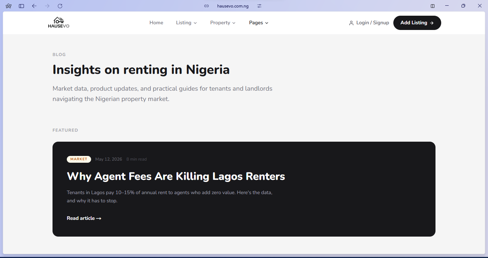
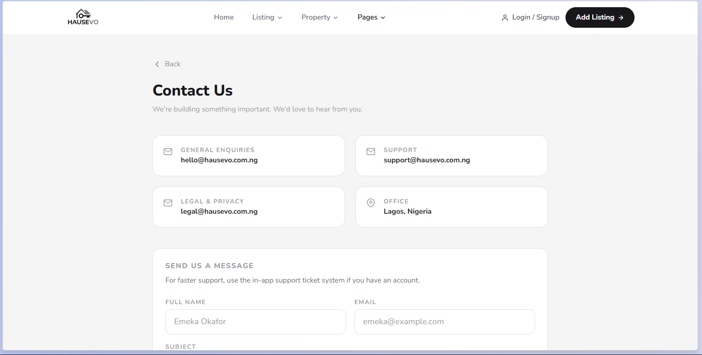

# Hausevo — Modern Real Estate Platform for Nigeria

A full-featured property listing and management system built to solve real operational challenges in the Nigerian real estate market. It enables property agents, developers, and operations teams to list properties efficiently, manage tenants, handle maintenance, disputes, and run daily operations with minimal friction.

## Live Demo

- **Website**: [hausevo.com.ng](https://hausevo.com.ng)
- **Admin Dashboard**: (Add demo login link when ready)

## Screenshots

  
  
  


## Key Features

### Admin & Operations Dashboard
- Rich property listings with multiple photos, pricing, health scores, and verification status
- Complete tenancy and tenant lifecycle management
- Maintenance request creation, tracking, and resolution
- Dispute handling and resolution workflow
- Artisans and service providers management
- Support ticket system
- Audit logs and activity tracking
- Real-time updates with clean, responsive interface

### Technical Highlights
- Scalable architecture designed for production use
- Secure deployment pipeline
- Modular and maintainable codebase

## Tech Stack


- **AI Integration**: Google Gemini
- **Deployment**: PM2 + Nginx on VPS

## Local Setup

```bash
# Clone the repository
git clone https://github.com/thatmanfrancis/Hausevo.git

# Navigate into the project directory
cd Hausevo

# Install dependencies
npm install

# Copy environment variables
cp .env.example .env

# Run database migrations
npx prisma migrate dev

# Start the development server
npm run dev

## Challenges & Learnings

While building Hausevo as a full-stack project, I encountered and successfully resolved several technical and architectural challenges:

- Designed and implemented a robust database schema using Prisma that handles complex relationships between properties, tenancies, users, maintenance requests, and disputes while maintaining good performance.
- Built a flexible admin dashboard that gives operations teams significant autonomy, reducing the need for constant developer intervention.
- Implemented proper file upload handling, image optimization, and secure storage for property photos.
- Set up a complete deployment pipeline from local development to production server, including PM2 process management, Nginx configuration, and zero-downtime deployment strategies.
- Integrated Google Gemini for potential AI-assisted features while keeping the core system stable and performant.
- Focused heavily on code organization and maintainability to ensure future developers (or myself) can easily extend the platform.

This project significantly strengthened my ability to take a product from initial concept through to production deployment while maintaining clean architecture and user-focused design.

```Built by [thatmanfrancis](https://x.com/thatmanfrancis)