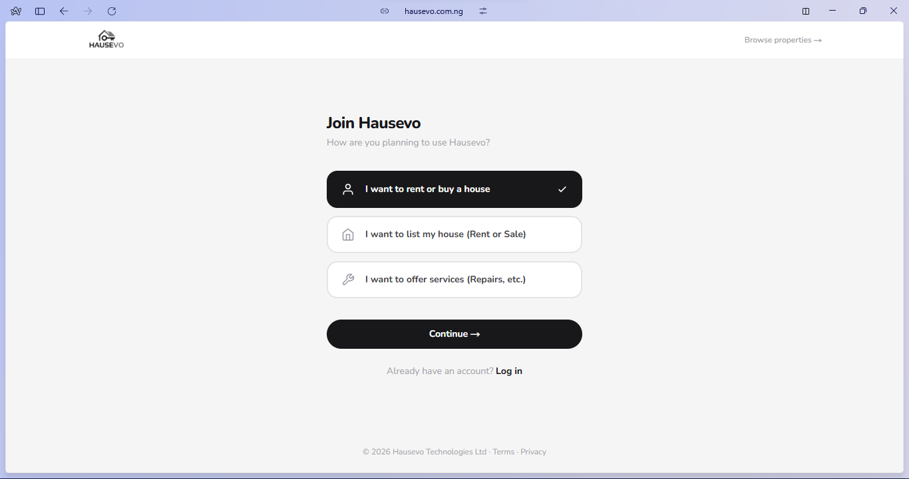

# Hausevo — End-to-End Property & Tenancy Management for Nigeria

Hausevo is a full-stack real estate platform purpose-built for the Nigerian rental market. It goes far beyond property listings — it manages the **entire lifecycle** of a tenancy, from property discovery and tenant vetting through rent collection, maintenance coordination, dispute resolution, and move-out condition reporting.

The platform serves **four distinct user roles** — Tenants, Landlords, Artisans, and Admins — each with dedicated dashboards, workflows, and permissions. Every feature is designed around the real friction points of renting in Lagos: opaque pricing, unverified listings, agent middlemen, cash-based rent collection, and zero recourse when things go wrong.

## Live Demo

 **Website**: [hausevo.com.ng](https://hausevo.com.ng)

## Screenshots




---

## Platform Architecture

Hausevo is organized around four role-based portals, a public-facing site, and a shared API layer:

```
├── (public)      → Marketing site, property search, blog, about, FAQ, legal pages
├── (auth)        → Login, signup, multi-step onboarding with KYC
├── (dashboard)   → Tenant portal (wallet, vault, scout, AI assistant, chat, etc.)
├── (landlord)    → Landlord portal (properties, tenancies, access keys, chat)
├── (artisan)     → Artisan portal (jobs, wallet, profile)
├── (admin)       → Operations dashboard (full platform management)
└── api/          → 28 API route groups powering the platform
```

---

## Core Feature Systems

###  Property Listings & Discovery

- Multi-image listings with pricing (annual, biannual, quarterly, monthly frequencies reflecting Lagos market norms)
- Listing types: **Rent**, **Sale**, **Lease**, and **Shortlet**
- Development stage tracking for off-plan properties (Land → Foundation → Carcass → Finished)
- Property health scores, verification status, and deed verification
- Search and filter by Lagos LGA, property type, and price range
- Property waitlists for high-demand units
- Wishlists with preference matching and notifications

###  Tenant Lifecycle

- **Onboarding**: Multi-step onboarding flow with employment profile, ID document upload, selfie verification, and emergency contacts
- **Applications**: Apply for properties with ShackScore snapshot, guarantor system with email-based acknowledgment tokens
- **Tenancy Management**: Active tenancy tracking with rent schedules, savings goals, joint tenancies (co-tenants), and digital tenancy agreements with dual-party signing
- **Condition Reports**: Move-in and move-out photo documentation with tenant/owner acknowledgment and caution deposit claims
- **Moving Orders**: Schedule and track moves with provider assignment and pricing

###  Financial Infrastructure

- **Wallet System**: In-app wallet with balance tracking, Paystack-powered payments, and transaction history
- **Transaction Engine**: 15+ transaction types — rent, caution deposits, commissions, milestone payments, mortgage repayments, withdrawals, bond contributions, and more
- **Escrow & Locked Funds**: Transaction statuses include escrow and locked states for secure rent handling
- **Rent Schedules**: Automated rent due tracking with configurable frequencies
- **Joint Savings**: Collaborative rent-pooling feature where multiple users contribute toward a shared savings goal
- **Bank Accounts**: Verified bank account management for withdrawals

###  Document Vault

- Secure document storage for tenants and landlords
- Categories: Identity, Deed, Receipt, Legal, Inspection, Utility
- Structured KYC tracking with NIN, Passport, Work ID, and Bank Statement document types
- Premium vault tiers with configurable storage limits
- Verification workflow for uploaded documents

###  Scout & Referral System

- **Scout Rewards**: Users earn rewards for bringing verified properties onto the platform via Access Keys
- **Referral Codes**: User-generated referral codes with usage tracking
- **Access Keys**: Unique keys issued by landlords, redeemable by scouts, tied to specific properties

###  AI Assistant

- Conversational AI powered by Google Gemini
- Per-user message history for contextual responses
- Integrated into the tenant dashboard for property guidance and platform assistance

###  Maintenance & Artisan Network

- **Maintenance Jobs**: Full lifecycle tracking — open, assigned, in-progress, completed, verified, paid, or disputed
- **Before/After Photos**: Visual documentation for every maintenance job
- **Artisan Profiles**: Vetted artisans across 8 categories (Plumber, Electrician, AC Technician, Carpenter, Painter, Cleaner, Security, General)
- **Bond System**: Artisans accumulate a safety bond through completed jobs, which reduces their commission rate over time
- **Service Requests**: Tenants request common services (Internet, DSTV, Generator, Fumigation, Cleaning, Security)

###  Dispute Resolution

- Formal dispute filing between users (tenant ↔ landlord)
- Dispute types: Maintenance, Rent, Caution Deposit, Property Condition
- Evidence attachment support
- Admin-mediated resolution workflow with escalation path

###  Chat System

- Property-scoped chat rooms between tenants and landlords
- Identity reveal control (anonymous until opted in)
- Real-time messaging

###  Trust & Verification

- **ShackScore**: Platform-wide trust score (0–1000) based on on-time payments, late payments, disputes raised/lost, and completed tenancies
- **Tiered Verification**: Progressive verification levels (Tier 0 → higher tiers) with paid verification bundles
- **Property Verification**: Deed verification, price verification, and landlord confirmation workflows
- **Two-Factor Authentication**: TOTP-based 2FA with QR code setup
- **Guarantor System**: Digital guarantor acknowledgment with unique tokens, email notifications, and IP tracking

###  Admin Operations Dashboard

- Complete user management with role assignments
- Property moderation, verification, and flagging
- Tenancy oversight and lifecycle management
- Maintenance job coordination and artisan assignment
- Dispute queue with resolution tools
- Support ticket system with priority levels and assignees
- Waitlist management
- WhatsApp integration testing
- Full audit logging (create, update, delete, login, verify, flag, approve, reject, payment, access)

###  Progressive Web App

- Installable PWA with offline support
- Native-like experience on mobile devices
- Cookie consent and privacy compliance

###  Public Pages

- SEO-optimized property listings with sitemap and robots.txt
- Blog/content system
- About, Team, Careers pages
- FAQ, Contact, and legal pages (Terms, Privacy, Cookies)

---

## Tech Stack


| Layer              | Technology                                                   |
| ------------------ | ------------------------------------------------------------ |
| **Framework**      | Next.js 16 (App Router) with React 19                        |
| **Language**       | TypeScript 5                                                 |
| **Styling**        | Tailwind CSS 4                                               |
| **Database**       | PostgreSQL via Prisma 7 ORM                                  |
| **Authentication** | NextAuth v5 (credentials + Google OAuth) with Prisma adapter |
| **Payments**       | Paystack Inline JS                                           |
| **File Storage**   | Cloudinary                                                   |
| **AI**             | Google Gemini                                                |
| **2FA**            | OTPLib + QR Code generation                                  |
| **Notifications**  | Sonner toast system + in-app notification center             |
| **Analytics**      | Google Analytics (gtag)                                      |
| **PWA**            | @ducanh2912/next-pwa                                         |
| **Deployment**     | PM2 process management + Nginx reverse proxy on VPS          |

---

## Database Schema

The Prisma schema defines **30+ models** covering the full domain:

| Domain            | Models                                                                                             |
| ----------------- | -------------------------------------------------------------------------------------------------- |
| **Users & Auth**  | User, Account, Session, VerificationToken, NotificationPreferences                                 |
| **Properties**    | Property, PropertyImage, SavedProperty, PropertyWishlist, Waitlist, PropertyManagement             |
| **Tenancy**       | Tenancy, TenancyApplication, TenancyAgreement, RentSchedule, ConditionReport, MovingOrder          |
| **Finance**       | Transaction, BankAccount, JointSavings, SavingsContribution, FinancingOption, Milestone            |
| **Maintenance**   | MaintenanceJob, ServiceRequest, ArtisanProfile, Inspection                                         |
| **Trust**         | ShackScore, Review, Dispute, Guarantor, DocumentVault                                              |
| **Communication** | ChatRoom, Message, Notification, AIMessage                                                         |
| **Platform**      | AccessKey, ScoutReward, ReferralCode, Referral, SupportTicket, SupportMessage, AuditLog, VaultItem |
| **Growth**        | LaunchWaitlist                                                                                     |

---

## Local Setup

#### Clone the repository

```bash
git clone https://github.com/thatmanfrancis/Hausevo.git
```

#### Navigate into the project directory

```bash
cd Hausevo
```

#### Install dependencies

```bash
npm install
```

#### Copy environment variables

```bash
cp .env.example .env
```

Configure the following in your `.env`:

- `DATABASE_URL` — PostgreSQL connection string
- `NEXTAUTH_SECRET` — Auth session secret
- `GOOGLE_CLIENT_ID` / `GOOGLE_CLIENT_SECRET` — Google OAuth credentials
- `CLOUDINARY_*` — Cloudinary API credentials for image uploads
- `PAYSTACK_SECRET_KEY` — Paystack payment processing
- `GEMINI_API_KEY` — Google Gemini AI integration
- `NEXT_PUBLIC_GA_ID` — Google Analytics tracking ID

#### Run database migrations

```bash
npx prisma migrate dev
```

#### Seed the database (optional)

```bash
npm run seed
```

#### Start the development server

```bash
npm run dev
```

The app will be available at `http://localhost:3001`.

---

## Project Structure

```
src/
├── app/
│   ├── (public)/        # Marketing pages, property search, blog, legal
│   ├── (auth)/          # Login, signup, multi-step onboarding
│   ├── (dashboard)/     # Tenant portal — 13 feature modules
│   │   ├── ai-assistant/    # AI-powered property guidance
│   │   ├── applications/    # Tenancy application tracking
│   │   ├── chat/            # Landlord-tenant messaging
│   │   ├── dashboard/       # Tenant overview
│   │   ├── favorites/       # Saved properties
│   │   ├── notifications/   # Notification center
│   │   ├── profile/         # User profile management
│   │   ├── scout/           # Scout rewards program
│   │   ├── security/        # 2FA and security settings
│   │   ├── settings/        # App preferences
│   │   ├── tenant/          # Active tenancy management
│   │   ├── vault/           # Document vault
│   │   └── wallet/          # Payments and transactions
│   ├── (landlord)/      # Landlord portal — properties, tenancies, access keys
│   ├── (artisan)/       # Artisan portal — jobs, wallet, profile
│   ├── (admin)/         # Admin operations — 15 management modules
│   └── api/             # 28 API route groups
├── components/          # Shared UI components
├── emails/              # Email templates
├── generated/           # Prisma generated client
├── lib/                 # Utilities, auth config, database client
└── types/               # TypeScript type definitions
```

---

## Challenges & Learnings

Building Hausevo as a full-stack project required solving several complex technical and domain-specific challenges:

- **Complex relational data modeling**: Designed a 30+ model Prisma schema handling deep relationships between properties, tenancies, users, maintenance jobs, disputes, financial transactions, and trust scores — all while keeping queries performant.
- **Multi-role authorization**: Built four distinct user portals with role-based access control, each with its own layout, navigation, and feature set, powered by a single NextAuth session.
- **Financial transaction integrity**: Implemented a transaction engine supporting 15+ types with escrow states, locked funds, and commission calculations — critical for a platform handling real money.
- **Trust & verification pipeline**: Designed the ShackScore algorithm, tiered verification system, guarantor acknowledgment flow, and deed verification workflow to build trust in a market plagued by fraud.
- **Nigerian market localization**: Adapted rent frequency options (annual upfront is the Lagos default), Lagos LGA-based search, Naira pricing, Paystack integration, and NIN/BVN document types to match local market realities.
- **Production deployment**: Set up a complete pipeline from local development to VPS production, including PM2 process management, Nginx configuration, Cloudinary media delivery, and zero-downtime deployments.

This project pushed my ability to architect, build, and ship a production-grade product that solves real operational problems in the Nigerian real estate space.

---

Built by [@thatmanfrancis](https://x.com/thatmanfrancis)
